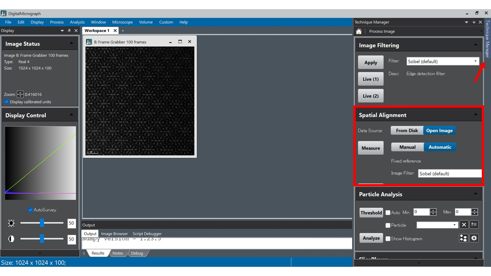
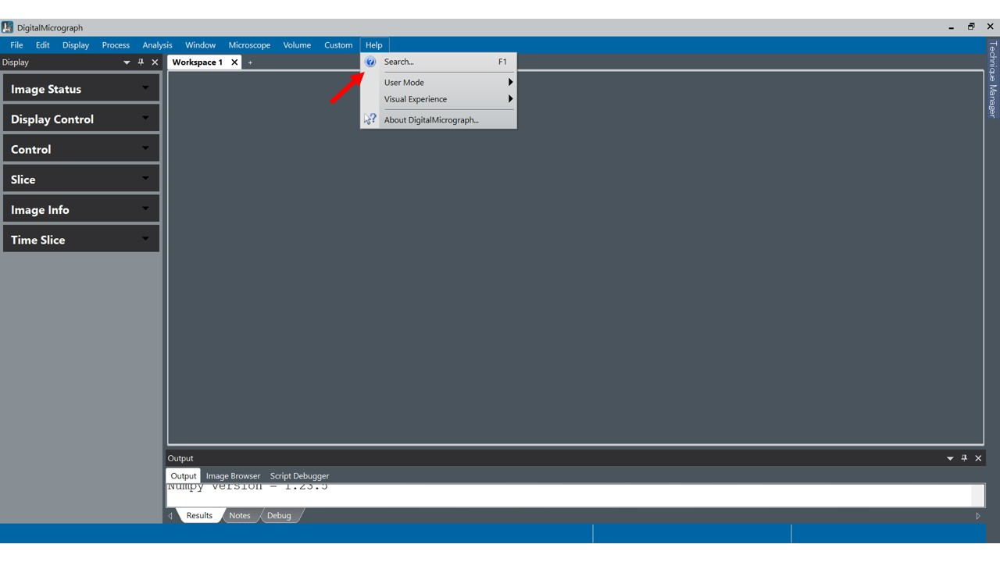
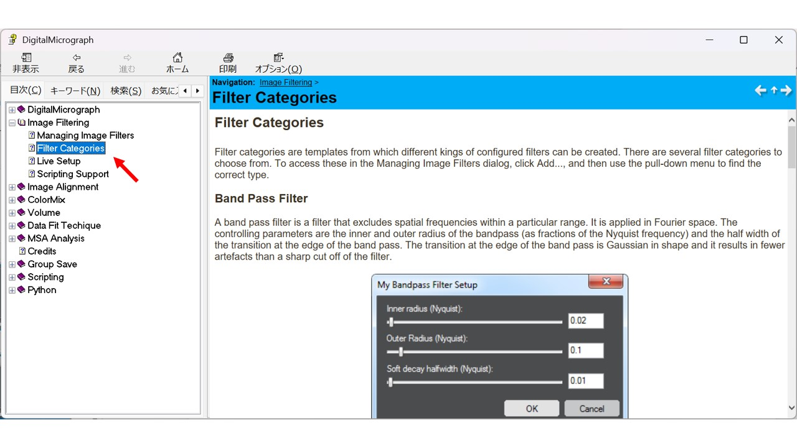
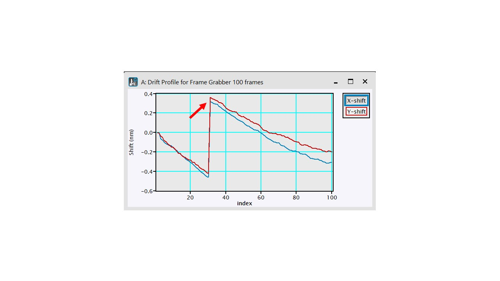
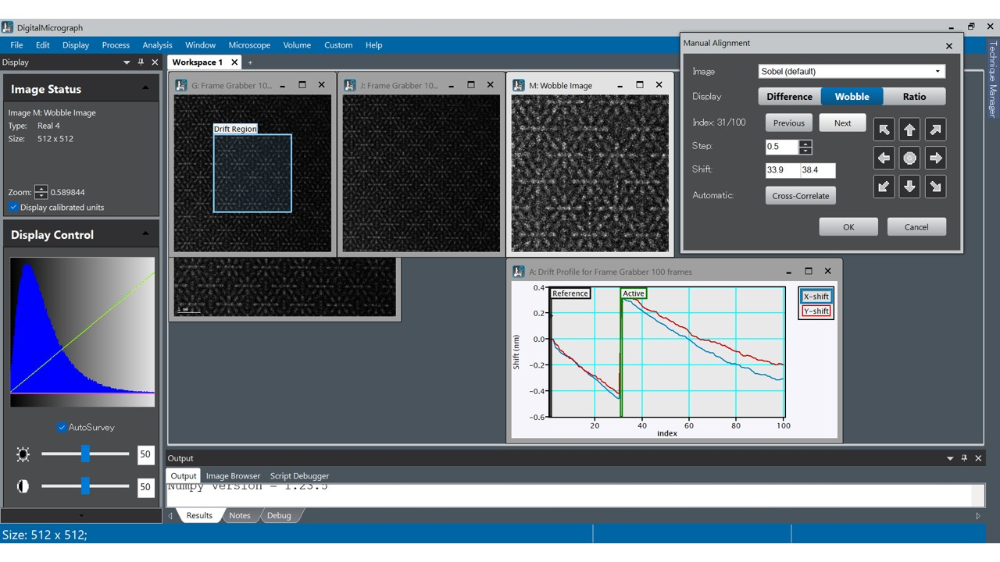
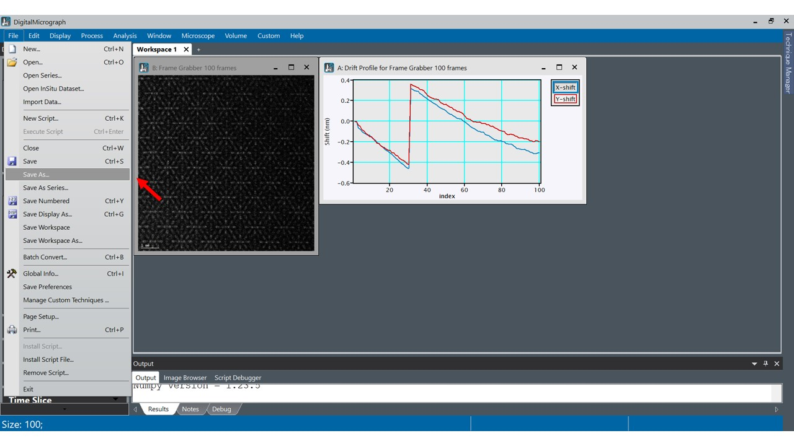
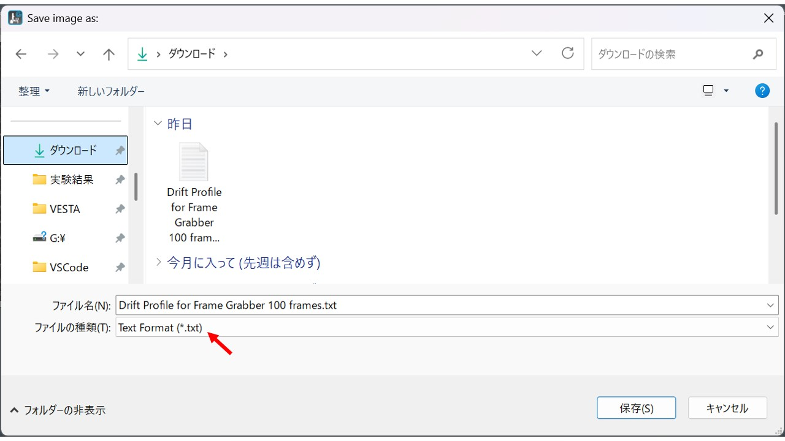
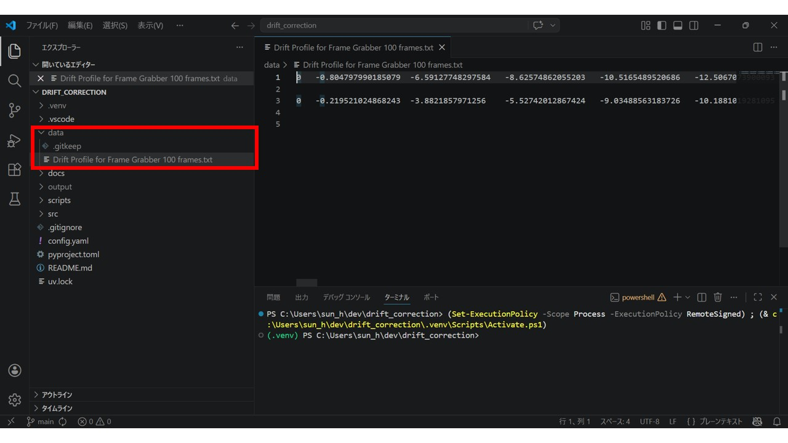
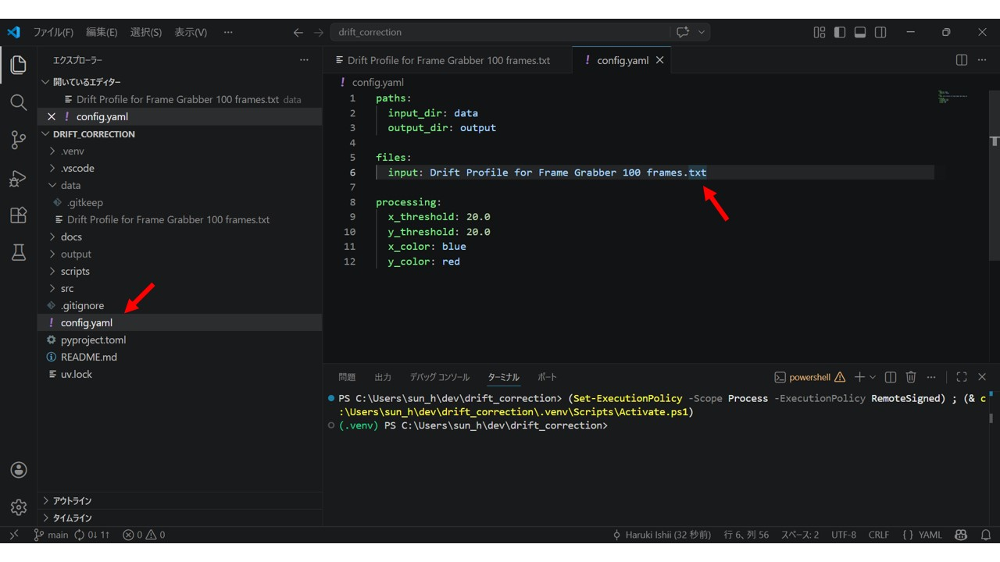
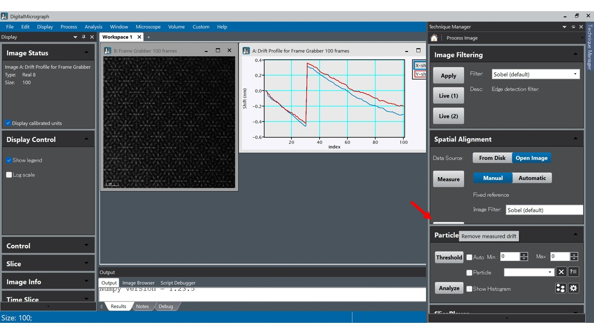

# 3Dイメージング ドリフト補正マニュアル

## 1. 自動補正の実行と課題

まずはソフトウェアの自動補正機能を使用して、大まかなドリフト補正を行います。

### 自動補正の実行

1. 画像を開いた状態で `Technique Manager` → `Process Image` → `Spatial Alignment` を選択し、`Automatic` に設定します。
2. `Image Filter`（Sobel など）を選択し、`Measure` を実行します。

補足: DigitalMicrograph (DM) フィルタ定義の確認手順

DigitalMicrograph 内で使用される各フィルタ（Bandpass、Sobel など）のアルゴリズムや数学的定義は、内蔵ヘルプから確認できます。

1. ヘルプメニューの起動
   - DM のメニューバーから `Help` > `Search...` を選択します。
   - ヘルプウィンドウ左側で `目次` タブを使用します。
2. 該当項目のナビゲーション
   - 以下のツリーを順番に展開します。
   - `Image Filtering`
   - `Filter Categories`
3. 内容の確認
   - `Filter Categories` を選択すると、右側パネルにフィルタ一覧と詳細情報が表示されます。

### 発生する問題

- 空間的に似た場所が多い画像データでは、途中で基準位置を誤認識することがあります。
- その結果、補正値が急激に跳ね上がり（ズレ）、連続性が崩れる場合があります。

### 手動での修正手順（Manualモード）

ズレた箇所をソフトウェア上で手動修正する場合は、以下の手順で行います。

1. `Technique Manager` を開き、設定を `Automatic` から **`Manual`** に変更して `Measure` を押します。
2. 基準となる最初の画像（0 枚目）と現在画像の比較画面を開きます。
3. 画面の `Next` ボタンを押して、インデックス（画像枚数）を順番に進めます。
4. 補正値が急激に跳ね上がる箇所（例: -49 から急に 33 になるなど）を見つけたら、前後のインデックス値を参考に、妥当な数値を手動入力します。
5. より細かく位置を合わせたい場合は、移動単位を `0.3` や `0.1` などに設定し、画面上の 8 方向矢印ボタンで微調整を行います。

### 手動修正の課題

- ソフトウェアの `Manual` モードで、すべての画像を 1 枚ずつ確認・修正すれば、正確な補正が可能です。
- ただし、データ量が多い場合は工数が大きく、全データに対して実施するのは非常に手間がかかります。

そのため、以下の **補正プログラム「Drift Collection」** を使用して作業を効率化します。

## 2. プログラムを活用した補正手順

### ステップ1: ドリフトデータのエクスポート

自動補正で算出した「ズレてしまった数値データ」を一度書き出します。

1. ソフトウェアのメニューから `File` > `Save As` を選択します。

2. 保存形式を **Text Format** にしてデータを保存します。

### ステップ2: プログラム（Drift Collection）の準備

1. 保存したテキストファイルを、プログラムの `data` フォルダ内にドラッグ＆ドロップして配置します。

2. `config` ファイルを開き、読み込ませたいファイル名（ステップ1で保存したファイル名）を入力します。
3. `Ctrl + S` などで `config` ファイルを保存します。

補足:

- `config` 内では、異常なズレを検知するための **閾値（例: 20）** を設定できます。
- グラフのズレ幅に合わせて数値を調整してください（例: 10 へ変更）。

### ステップ3: プログラムの実行

1. ターミナルを開き、`scripts` フォルダ内のスクリプト `main.py` を実行します。
   実行方法の詳細は [README.md](../README.md) を参照してください。
2. 処理完了後、`output` フォルダ内に実行日時のフォルダが自動作成されます。
3. 出力フォルダには、次の成果物が含まれます。

- 急激なズレを前後の値に合わせて補正したデータ（テキストファイル）
- 補正前後の状態を確認できるグラフ画像

### ステップ4: ソフトウェアへの補正値の入力

出力された正しい数値を、ソフトウェア側に入力していきます。

1. ソフトウェアの `Technique Manager` を開き、`Automatic` から `Manual` に変更して `Measure` を押します。
2. `Next` ボタンでインデックス（画像枚数）を進めながら、プログラム出力テキストに記載された数値（X, Y の小数第 1 位まで）を、該当インデックスへ入力します。

### ステップ5: 補正値でドリフト補正

1. 数値の修正が完了したら、`Spatial Alignment` の `Remove Measured Drift` ボタンを押して、補正値を適用します。
2. `Remove Measured Drift` ボタンは表示位置が分かりにくく、隠れて見えにくい場合があるため注意してください。

### 微調整と仕上げ

- プログラムによる補正は簡易的な計算に基づきます。
- 数値入力後は、必要に応じて目視で微調整（0.1 単位での変更など）を実施してください。
- 必要であれば再度ドリフト補正をかけ、精度を高めてください。
